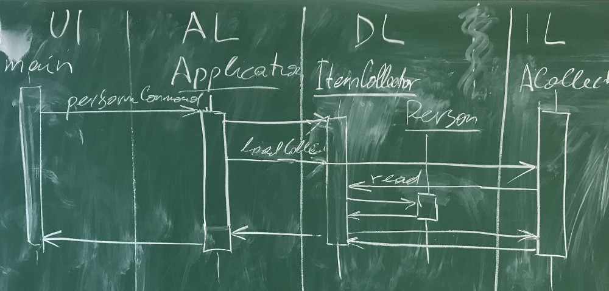

Министерство науки и высшего образования Российской Федерации  
Федеральное государственное бюджетное образовательное учреждение  
высшего образования  
«Кубанский государственный аграрный университет  
им. И.Т. Трубилина

ФАКУЛЬТЕТ ПРИКЛАДНОЙ ИНФОРМАТИКИ  
КАФЕДРА ИНФОРМАЦИОННЫХ СИСТЕМ

 

ОТЧЕТ  
к лабораторной работе №1  
по дисциплине "Современные технологии разработки  
программного обеспечения"  
Реализация приложения в многоуровневой архитектуре  
с использованием удалённого репозитория кода

 

Преподаватель: Петров А.А.

Студент группы:

## Описание задания

Задача № 0: "Мои друзья".

Вариант задания № 0: Постройте диаграмму последовательности выполнения команды load. Диаграмма должна показывать прохождение выполнения команды между программными объектами, расположенными в соответствующих слоях многоуровневой архитектуры.

## Адрес проекта

Проект хранится в удаленном репозитории по адресу: [https://github.com/anton-petrov/msdtm/labs/1](https://github.com/anton-petrov/msdtm/labs/1).

## Диаграммы классов

Диаграммы классов создаются автоматически при обновлении ветки `master` в удаленном репозитории GitLab и выкладываются в страницы проекта по адресу: [https://github.com/anton-petrov/msdtm/labs/1](https://github.com/anton-petrov/msdtm/labs/1).

## Диаграмма последовательности

Последовательность выполнения команды load:

## Выводы

!!!!!!!!!!!
